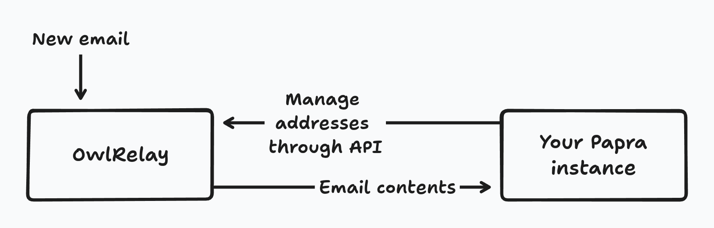
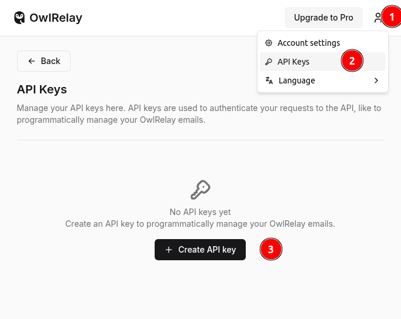

import { Aside } from '@astrojs/starlight/components';
import { Steps } from '@astrojs/starlight/components';

This guide will show you how to setup Papra to receive emails using [OwlRelay](https://owlrelay.email).

[OwlRelay](https://owlrelay.email) is an open-source agnostic email-to-http service developed by the Papra team. It's a free service that allows you to receive emails and forward them to your self-hosted Papra instance.


## Prerequisites

In order to follow this guide, your Papra instance needs to be running and accessible from the internet.

## How it works

By integrating Papra with OwlRelay, your instance will generate email addresses on OwlRelay through it's API (specifying a webhook on your Papra instance). And OwlRelay will forward the emails to your Papra instance through a webhook.




## Setup
<Steps>

1. **Create an account on OwlRelay**

   Go to [owlrelay.email](https://owlrelay.email) and create an account.

2. **Create an OwlRelay API key**

   Once you have created your account, you can create an API key by going to the [API keys page](https://app.owlrelay.email/api-keys).

   

3. **Configure your Papra instance**

   Once you have created your API key, you can configure your Papra instance to receive emails by setting the `OWLRELAY_API_KEY` and `INTAKE_EMAILS_WEBHOOK_SECRET` environment variables.

   ```bash
   # Enable intake emails
   INTAKE_EMAILS_IS_ENABLED=true

   # Tell your Papra instance to use OwlRelay
   INTAKE_EMAILS_DRIVER=owlrelay

   # This is your OwlRelay API key
   OWLRELAY_API_KEY=owrl_*****

   # Set a random key that will be transmitted to OwlRelay to sign the requests,
   # this is to authenticate that the emails are coming from OwlRelay
   INTAKE_EMAILS_WEBHOOK_SECRET=a-random-key

   # [Optional]
   # This is the URL that OwlRelay will send the emails to,
   # if not provided, the webhook will be inferred from the server URL.
   # Can be relevant if you have multiple urls pointing to your Papra instance
   # or when using tunnel services
   OWLRELAY_WEBHOOK_URL=https://your-instance.com/api/intake-emails/ingest
   ```

4. **That's it!**

   You can now generate intake emails in your Papra instance and send emails with attachments to the email address generated.

</Steps>

## Troubleshooting

If you encounter any issues, you can:
- Check the logs of your Papra instance to see if there are any errors.
- Connect to your OwlRelay account to see if the emails address are generated and emails are received.

