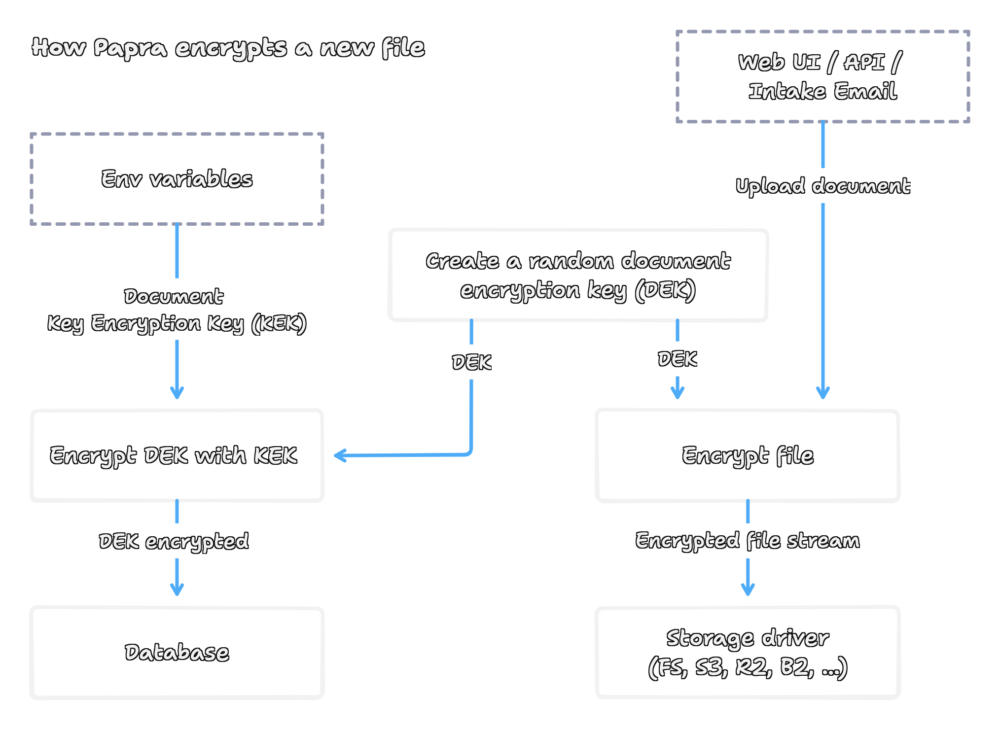
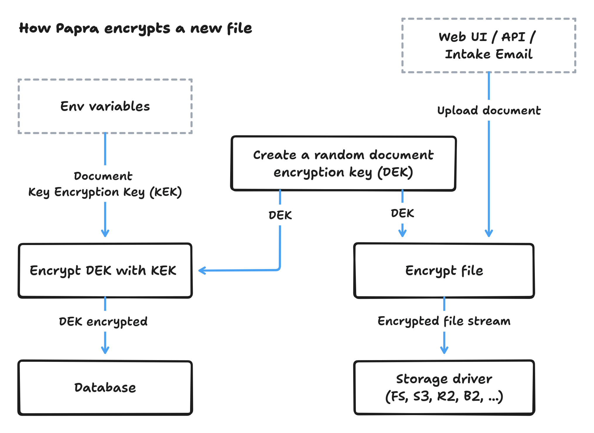

import { Steps } from '@astrojs/starlight/components';
import { Aside } from '@astrojs/starlight/components';
import { Code } from '@astrojs/starlight/components';
import { Tabs, TabItem } from '@astrojs/starlight/components';
import EncryptionKeyGenerator from '../../../components/encryption-key-generator.astro';

<Aside type="note">
Document encryption is available in Papra v0.9.0 and above.
</Aside>

Document encryption in Papra provides end-to-end protection for your stored documents using industry-standard AES-256-GCM encryption. This guide will walk you through enabling encryption, understanding how it works, and managing encryption keys.

## How Encryption Works

Papra uses a two-layer encryption approach that provides both security and flexibility:

### Key Encryption Architecture

1. **Key Encryption Key (KEK)**: A master key that you provide, used to encrypt document-specific keys
2. **Document Encryption Key (DEK)**: Unique per-document keys that actually encrypt your files
3. **File Encryption**: Each document gets its own random 256-bit encryption key for maximum security

<div class="dark:block hidden">

</div>
<div class="dark:hidden block">

</div>

### Encryption Flow

<Steps>

1. **Document Upload**: When you upload a document, Papra generates a unique 256-bit encryption key (DEK)

2. **File Encryption**: The document is encrypted using AES-256-GCM with the DEK

3. **Key Wrapping**: The DEK is encrypted (wrapped) using your Key Encryption Key (KEK)

4. **Storage**: The encrypted document and wrapped DEK are stored separately - the file in your storage backend, the wrapped key in the database along with the document metadata

5. **Retrieval**: When accessing a document, Papra unwraps the DEK using your KEK, then decrypts the file stream

</Steps>

<Aside type="note">
This architecture means that even if someone gains access to your file storage, they cannot decrypt documents without access to both your document records and your KEK, in other words, without your database and your environment variables.
</Aside>

## Quick Setup

<Steps>

1. **Generate an encryption key**

   Generate a secure random 256-bit key in hex format, using this generator or OpenSSL command.

   <Tabs>
    <TabItem label="Key generator">
    <EncryptionKeyGenerator />
    </TabItem>

   <TabItem label="OpenSSL command">
   ```bash
   openssl rand -hex 32
   ```

   This will output something like: `0deba5534bd70548de92d1fd4ae37cf901cca3dc20589b7e022ddb680c98e50c`
   </TabItem>

   </Tabs>


2. **Enable encryption in your configuration**

   Add the following environment variables to your `.env` file or Docker configuration:

   ```bash
   DOCUMENT_STORAGE_ENCRYPTION_IS_ENABLED=true
   DOCUMENT_STORAGE_DOCUMENT_KEY_ENCRYPTION_KEYS=<your-encryption-key>
   ```

3. **Restart Papra**

   Restart your Papra instance to apply the encryption settings.

</Steps>

## Configuration Options

### Environment Variables

| Variable | Description | Required |
|----------|-------------|----------|
| `DOCUMENT_STORAGE_ENCRYPTION_IS_ENABLED` | Enable/disable document encryption | No |
| `DOCUMENT_STORAGE_DOCUMENT_KEY_ENCRYPTION_KEYS` | Key encryption keys for document encryption | Yes (if encryption enabled) |

### Key Formats

<Tabs>
  <TabItem label="Single Key">
    For simple setups, provide a single 32-byte hex string:

    ```bash
    DOCUMENT_STORAGE_DOCUMENT_KEY_ENCRYPTION_KEYS=<your-encryption-key>
    ```

    This key will automatically be assigned version `1`.
  </TabItem>

  <TabItem label="Multiple Keys">
    For key rotation and advanced setups, provide versioned keys:

    ```bash
    DOCUMENT_STORAGE_DOCUMENT_KEY_ENCRYPTION_KEYS=1:<your-encryption-key-1>,2:<your-encryption-key-2>
    ```

    - The highest version key encrypts new documents
    - All keys can decrypt existing documents
    - Versions can be any alphabetically sortable string
    - Order in the list doesn't matter
  </TabItem>
</Tabs>

## Docker Compose Setup

Add encryption configuration to your Docker Compose file:

<Tabs>
  <TabItem label="Environment Variables">
    ```yaml title="docker-compose.yml" ins={8-9}
    services:
      papra:
        container_name: papra
        image: ghcr.io/papra-hq/papra:latest
        restart: unless-stopped
        environment:
          # ... other environment variables ...
          - DOCUMENT_STORAGE_ENCRYPTION_IS_ENABLED=true
          - DOCUMENT_STORAGE_DOCUMENT_KEY_ENCRYPTION_KEYS=<your-encryption-key>
        volumes:
          - ./app-data:/app/app-data
        ports:
          - "1221:1221"
    ```
  </TabItem>

  <TabItem label="Config File">
    ```yaml title="docker-compose.yml"
    services:
      papra:
        container_name: papra
        image: ghcr.io/papra-hq/papra:latest
        restart: unless-stopped
        volumes:
          - ./app-data:/app/app-data
          - ./papra.config.yaml:/app/app-data/papra.config.yaml
        ports:
          - "1221:1221"
    ```

    ```yaml title="./papra.config.yaml"
    documentsStorage:
      encryption:
        isEncryptionEnabled: true
        documentKeyEncryptionKeys: "<your-encryption-key>"
    ```
  </TabItem>
</Tabs>

## Key Management

### Key Rotation

Key rotation allows you to replace encryption keys without losing access to existing documents:

<Steps>

1. **Generate a new key**

   ```bash
   openssl rand -hex 32
   ```

2. **Add the new key with a higher version**

   ```bash
   DOCUMENT_STORAGE_DOCUMENT_KEY_ENCRYPTION_KEYS=1:old_key_here,2:new_key_here
   ```

3. **Restart Papra**

   New documents will use the highest version key (version 2), while existing documents remain accessible with the old key.

4. **Optional: Remove old keys**

   Once you're confident all documents are using the new key, you can remove old keys. However, this will make any documents encrypted with old keys inaccessible.

</Steps>

<Aside type="caution">
Never remove a key version if there are still documents encrypted with that key, unless you're certain you no longer need access to those documents.
</Aside>

### Key Security Best Practices

1. **Store keys securely**: Use a secrets management system in production
2. **Use different keys per environment**: Development, staging, and production should have separate keys
3. **Backup your keys**: Loss of encryption keys means permanent loss of document access
4. **Rotate keys periodically**: Consider rotating keys annually or after security incidents
5. **Limit key access**: Only authorized personnel should have access to encryption keys

### Docker Secrets Example

For production environments, store your encryption keys securely using external secret management systems or secure file systems, and reference them via environment variables.

## Compatibility and Migration

### Enabling Encryption on Existing Instances

When you enable encryption on a Papra instance that already has documents:

- **Existing documents**: Remain unencrypted but accessible
- **New documents**: Are encrypted using the current KEK
- **Mixed storage**: Papra automatically handles both encrypted and unencrypted documents

### Migrating Existing Documents to Encrypted Format

If you want to encrypt all existing unencrypted documents after enabling encryption, Papra provides a maintenance command to handle this migration automatically.

<Aside type="caution">
It's advised to make a backup of your documents and database before running the migration. 
</Aside>

<Steps>

1. **Verify encryption is properly configured**

   Ensure encryption is enabled and working for new documents before migrating existing ones:

   ```bash
   # Check that your configuration includes:
   DOCUMENT_STORAGE_ENCRYPTION_IS_ENABLED=true
   DOCUMENT_STORAGE_DOCUMENT_KEY_ENCRYPTION_KEYS=<your-key>
   ```

2. **Run dry-run to preview changes**

   <Tabs>
     <TabItem label="Docker Compose">
       ```bash
       # Run dry-run inside the Docker container
       docker compose exec papra pnpm maintenance:encrypt-all-documents --dry-run
       ```
     </TabItem>

     <TabItem label="Docker">
       ```bash
       # Run dry-run inside the Docker container
       docker exec -it papra pnpm maintenance:encrypt-all-documents --dry-run
       ```
     </TabItem>

     <TabItem label="Source Installation">
       ```bash
       # From your Papra server directory
       pnpm maintenance:encrypt-all-documents --dry-run
       ```
     </TabItem>


   </Tabs>

   This will show you:
   - How many documents will be encrypted
   - Which documents will be affected
   - No actual encryption will be performed

4. **Run the migration**

   <Tabs>
     <TabItem label="Docker Compose">
       ```bash
       # Run migration inside the Docker container
       docker compose exec papra pnpm maintenance:encrypt-all-documents
       ```
     </TabItem>

     <TabItem label="Docker">
       ```bash
       # Run migration inside the Docker container
       docker exec -it papra pnpm maintenance:encrypt-all-documents
       ```
     </TabItem>

     <TabItem label="Source Installation">
       ```bash
       # From your Papra server directory
       pnpm maintenance:encrypt-all-documents
       ```
     </TabItem>
   </Tabs>

   The command will:
   - Find all unencrypted documents
   - Encrypt each document using your configured KEK
   - Update database records with encryption metadata
   - Remove original unencrypted files from storage
   - Provide progress logging throughout the process

5. **Verify migration success**

   After migration:
   - Test document access through the Papra interface
   - Check that storage files are now encrypted (should start with `PP01`)
   - Verify all documents are accessible and downloadable

</Steps>

<Aside type="tip">
**Migration Performance**

- The migration processes documents sequentially to ensure reliability
- Large document collections may take considerable time
- Monitor disk space during migration (temporary storage overhead)
- Consider running during maintenance windows for production systems
</Aside>

#### Troubleshooting Migration Issues

**Migration fails with "Document encryption is not enabled"**
- Verify `DOCUMENT_STORAGE_ENCRYPTION_IS_ENABLED=true` is set
- Restart Papra after configuration changes

**Migration fails with "Document encryption keys are not set"**
- Ensure `DOCUMENT_STORAGE_DOCUMENT_KEY_ENCRYPTION_KEYS` contains valid keys
- Verify key format is correct (64-character hex string)

**Migration stops or fails partway**
- Check available disk space
- Review Papra logs for specific error messages
- Restore from backup and retry after fixing the issue

**Documents inaccessible after migration**
- Verify encryption keys are still properly configured
- Check that Papra can access your storage backend
- Restore from backup if necessary

### Disabling Encryption

If you disable encryption:

- **Encrypted documents**: Remain encrypted but are automatically decrypted when accessed (if KEK is still available)
- **New documents**: Are stored unencrypted
- **Data loss risk**: If you remove the KEK while encrypted documents exist, those documents become inaccessible

<Aside type="caution">
Disabling encryption doesn't automatically decrypt existing documents in storage. They remain encrypted and require the KEK for access.
</Aside>

### Storage Driver Compatibility

The encryption layer sits between Papra and your chosen storage driver, providing consistent encryption regardless of where files are stored (S3, Azure Blob Storage, File System, etc.).

## Technical Details

### Encryption Algorithm

- **Algorithm**: AES-256-GCM (Authenticated Encryption)
- **Key size**: 256 bits (32 bytes)
- **IV size**: 96 bits (12 bytes)
- **Authentication tag**: 128 bits (16 bytes)

### File Format

Encrypted files use a custom format with a magic number for identification:

```
| Magic (4 bytes) | IV (12 bytes) | Encrypted Data | Auth Tag (16 bytes) |
```

- **Magic number**: `PP01` - identifies Papra encrypted files
- **IV**: Initialization vector for GCM mode
- **Encrypted Data**: The actual encrypted document content
- **Auth Tag**: Authentication tag for integrity verification

### Performance Considerations

- **Streaming encryption**: Files are encrypted/decrypted in streams, minimizing memory usage
- **No size overhead**: Minimal storage overhead (32 bytes per file for headers)
- **CPU impact**: Modern processors handle AES encryption efficiently

## Troubleshooting

### Common Issues

**"Document KEK required" error**
- Ensure `DOCUMENT_STORAGE_DOCUMENT_KEY_ENCRYPTION_KEYS` is set
- Verify the key format is correct (64 character hex string)

**"Document KEK not found" error**
- The document was encrypted with a key version that's no longer available
- Add the missing key version back to your configuration

**"Unsupported encryption algorithm" error**
- The document uses an encryption algorithm not supported by this Papra version
- This shouldn't occur in normal operation

**Performance issues**
- Consider your storage driver's performance characteristics
- Encryption adds minimal overhead, but network/disk I/O remains the bottleneck

### Verification

To verify encryption is working:

1. Upload a document after enabling encryption
2. Check your storage backend - the file should not be readable as plain text
3. The file should start with the magic number `PP01` if you examine it directly

<Aside>
You can find complete configuration options in the [configuration reference](/self-hosting/configuration). Look for variables prefixed with `DOCUMENT_STORAGE_ENCRYPTION_`.
</Aside>

## Security Considerations

### Threat Model

Document encryption in Papra protects against:

- **Storage compromise**: If your file storage is breached, documents remain encrypted
- **Database-only breach**: Without the KEK, wrapped DEKs cannot be unwrapped
- **Configuration exposure**: If the KEK is exposed, the files remain encrypted as long as the DEK are not exposed

### Limitations

Encryption does not protect against:

- **Application-level access**: Users with document access can view decrypted content
- **Memory dumps**: Decrypted content exists temporarily in application memory
- **Key and database compromise**: If KEKs are stolen, all DEKs can be decrypted if the database is compromised
- **Full system compromise**: If the entire Papra instance is compromised, documents can be accessed
