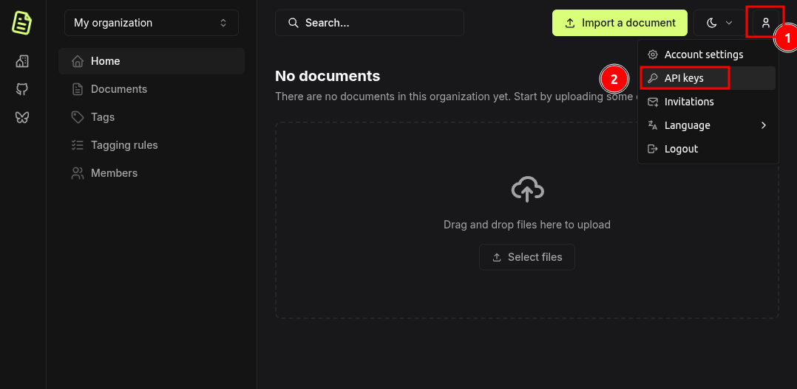
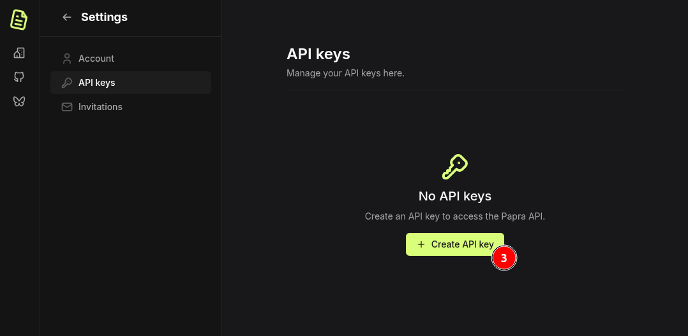

## Authentication

The public API uses a bearer token for authentication. You can get a token by logging to your Papra account and creating an API token.

<details>

<summary>How to create an API token</summary>




</details>


To authenticate your requests, include the token in the `Authorization` header with the `Bearer` prefix:

```
Authorization: Bearer YOUR_API_TOKEN
```

### Examples

**Using cURL:**
```bash
curl -H "Authorization: Bearer YOUR_API_TOKEN" \
  https://api.papra.app/api/organizations
```

**Using JavaScript (fetch):**
```javascript
const response = await fetch('https://api.papra.app/api/organizations', {
  headers: {
    'Authorization': 'Bearer YOUR_API_TOKEN',
    'Content-Type': 'application/json'
  }
})
```

### API Key Permissions

When creating an API key, you can select from the following permissions:

**Organizations:**
- `organizations:create` - Create new organizations
- `organizations:read` - Read organization information and list organizations of the user
- `organizations:update` - Update organization details
- `organizations:delete` - Delete organizations

**Documents:**
- `documents:create` - Upload and create new documents
- `documents:read` - Read and download documents
- `documents:update` - Update document metadata and content
- `documents:delete` - Delete documents

**Tags:**
- `tags:create` - Create new tags
- `tags:read` - Read tag information and list tags
- `tags:update` - Update tag details
- `tags:delete` - Delete tags

## Endpoints

### Check current API key

**GET** `/api/api-keys/current`

Get information about the currently used API key.

- Required API key permissions: none
- Response (JSON)
  - `apiKey`: The current API key information.
    - `id`: The API key ID.
    - `name`: The API key name.
    - `permissions`: The list of permissions associated with the API key.

### List organizations

**GET** `/api/organizations`

List all organizations accessible to the authenticated user.

- Required API key permissions: `organizations:read`
- Response (JSON)
  - `organizations`: The list of organizations.

### Create an organization

**POST** `/api/organizations`

Create a new organization.

- Required API key permissions: `organizations:create`
- Body (JSON)
  - `name`: The organization name (3-50 characters).
- Response (JSON)
  - `organization`: The created organization.

### Get an organization

**GET** `/api/organizations/:organizationId`

Get an organization by its ID.

- Required API key permissions: `organizations:read`
- Response (JSON)
  - `organization`: The organization.

### Update an organization

**PUT** `/api/organizations/:organizationId`

Update an organization's name.

- Required API key permissions: `organizations:update`
- Body (JSON)
  - `name`: The new organization name (3-50 characters).
- Response (JSON)
  - `organization`: The updated organization.

### Delete an organization

**DELETE** `/api/organizations/:organizationId`

Delete an organization by its ID.

- Required API key permissions: `organizations:delete`
- Response: empty (204 status code)

### Create a document

**POST** `/api/organizations/:organizationId/documents`

Create a new document in the organization.

- Required API key permissions: `documents:create`
- Body (form-data)
  - `file`: The file to upload.
  - `ocrLanguages`: (optional) The languages to use for OCR.
- Response (JSON)
  - `document`: The created document.

### List documents

**GET** `/api/organizations/:organizationId/documents`

List all documents in the organization.

- Required API key permissions: `documents:read`
- Query parameters
  - `pageIndex`: (optional, default: 0) The page index to start from.
  - `pageSize`: (optional, default: 100) The number of documents to return.
  - `tags`: (optional) The tags IDs to filter by.
- Response (JSON)
  - `documents`: The list of documents.
  - `documentsCount`: The total number of documents.

### List deleted documents (trash)

**GET** `/api/organizations/:organizationId/documents/deleted`

List all deleted documents (in trash) in the organization.

- Required API key permissions: `documents:read`
- Query parameters
  - `pageIndex`: (optional, default: 0) The page index to start from.
  - `pageSize`: (optional, default: 100) The number of documents to return.
- Response (JSON)
  - `documents`: The list of deleted documents.
  - `documentsCount`: The total number of deleted documents.

### Get a document

**GET** `/api/organizations/:organizationId/documents/:documentId`

Get a document by its ID.

- Required API key permissions: `documents:read`
- Response (JSON)
  - `document`: The document.

### Delete a document

**DELETE** `/api/organizations/:organizationId/documents/:documentId`

Delete a document by its ID.

- Required API key permissions: `documents:delete`
- Response: empty (204 status code)

### Get a document file

**GET** `/api/organizations/:organizationId/documents/:documentId/file`

Get a document file content by its ID.

- Required API key permissions: `documents:read`
- Response: The document file stream.

### Search documents

**GET** `/api/organizations/:organizationId/documents/search`

Search documents in the organization by name or content.

- Required API key permissions: `documents:read`
- Query parameters
  - `searchQuery`: The search query.
  - `pageIndex`: (optional, default: 0) The page index to start from.
  - `pageSize`: (optional, default: 100) The number of documents to return.
- Response (JSON)
  - `searchResults`: The search results.
    - `documents`: The list of matching documents.
      - `id`: The document ID.
      - `name`: The document name.

### Get organization documents statistics

**GET** `/api/organizations/:organizationId/documents/statistics`

Get the statistics (number of documents and total size) of the documents in the organization.

- Required API key permissions: `documents:read`
- Response (JSON)
  - `organizationStats`: The organization documents statistics.
    - `documentsCount`: The total number of documents.
    - `documentsSize`: The total size of the documents.

### Update a document

**PATCH** `/api/organizations/:organizationId/documents/:documentId`

Change the name or content (for search purposes) of a document.

- Required API key permissions: `documents:update`
- Body (form-data)
  - `name`: (optional) The document name.
  - `content`: (optional) The document content.
- Response (JSON)
  - `document`: The updated document.

### Get document activity

**GET** `/api/organizations/:organizationId/documents/:documentId/activity`

Get the activity log of a document.

- Required API key permissions: `documents:read`
- Query parameters
  - `pageIndex`: (optional, default: 0) The page index to start from.
  - `pageSize`: (optional, default: 100) The number of documents to return.
- Response (JSON)
  - `activities`: The list of activities.

### Create a tag

**POST** `/api/organizations/:organizationId/tags`

Create a new tag in the organization.

- Required API key permissions: `tags:create`
- Body (form-data)
  - `name`: The tag name.
  - `color`: The tag color in hex format (e.g. `#000000`).
  - `description`: (optional) The tag description.
- Response (JSON)
  - `tag`: The created tag.

### List tags

**GET** `/api/organizations/:organizationId/tags`

List all tags in the organization.

- Required API key permissions: `tags:read`
- Response (JSON)
  - `tags`: The list of tags.

### Update a tag

**PUT** `/api/organizations/:organizationId/tags/:tagId`

Change the name, color or description of a tag.

- Required API key permissions: `tags:update`
- Body
  - `name`: (optional) The tag name.
  - `color`: (optional) The tag color in hex format (e.g. `#000000`).
  - `description`: (optional) The tag description.
- Response (JSON)
  - `tag`: The updated tag.

### Delete a tag

**DELETE** `/api/organizations/:organizationId/tags/:tagId`

Delete a tag by its ID.

- Required API key permissions: `tags:delete`
- Response: empty (204 status code)

### Add a tag to a document

**POST** `/api/organizations/:organizationId/documents/:documentId/tags`

Associate a tag to a document.

- Required API key permissions: `tags:read` and `documents:update`
- Body
  - `tagId`: The tag ID.
- Response: empty (204 status code)

### Remove a tag from a document

**DELETE** `/api/organizations/:organizationId/documents/:documentId/tags/:tagId`

Remove a tag from a document.

- Required API key permissions: `tags:read` and `documents:update`
- Response: empty (204 status code)

### Apply tagging rule to existing documents

**POST** `/api/organizations/:organizationId/tagging-rules/:taggingRuleId/apply`

Enqueue a background task to apply a tagging rule to all existing documents in the organization. This endpoint returns immediately with a task ID, and the processing happens asynchronously in the background. The task will check all documents and apply tags where the rule's conditions match.

- Required API key permissions: `tags:read` and `documents:update`
- Response (JSON, HTTP 202)
  - `taskId`: The ID of the background task. You can use this to track the task's progress (task status retrieval coming in a future release).
