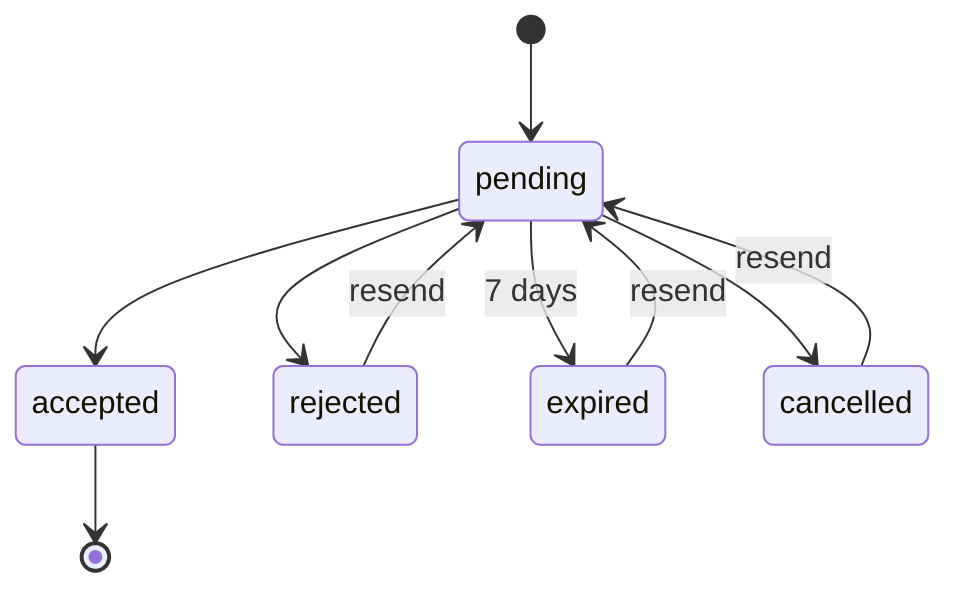

# Organization invitations specs

Privileged members of an organization (owner or admin) can invite other users to join the organization.

- Invitations are valid for 7 days (configurable)
- Invitations can be cancelled by a privileged member of the organization.
- Invitations can be rejected by the recipient.
- Invitations can be accepted by the recipient.
- Invitations that are expired, cancelled or rejected can be resend by a privileged member of the organization.

## Invitation statuses

- `pending`: The invitation has been sent but not yet accepted or rejected.
- `accepted`: The invitation has been accepted by the recipient.
- `rejected`: The invitation has been rejected by the recipient.
- `expired`: The invitation has expired.
- `cancelled`: The invitation has been cancelled by a privileged member of the organization.

State machine:

